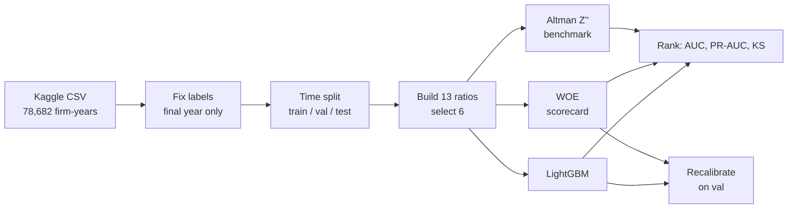
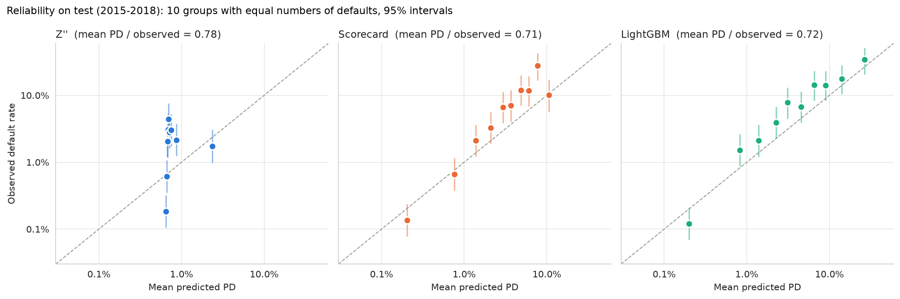
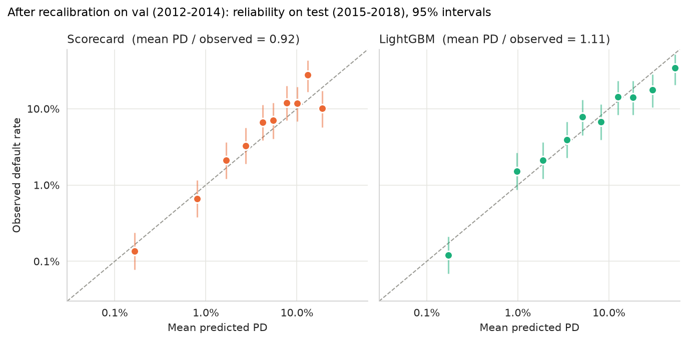

# One-Year Corporate Default Prediction

Predicts whether a US-listed company will file for bankruptcy (Chapter 7 or Chapter 11) in the next fiscal year, using six accounting ratios. Three models are compared on the same data: a fixed textbook benchmark, an interpretable credit scorecard, and a gradient-boosted model. Each is judged on **discrimination** (does it rank risky firms above safe ones?) and on **calibration** (are the probabilities themselves the right size?).

## Overview

All three models are scored out of time on 2015–2018: 12,282 firm-years, 119 defaults.

| Model | ROC AUC | PR-AUC lift | KS | Mean PD / observed | Why it's here |
| --- | --- | --- | --- | --- | --- |
| Altman Z'' (1995 coefficients, not refitted) | 0.773 | 2.4 | 0.526 | 0.78 | Fixed benchmark to beat |
| WOE logistic scorecard | 0.906 | 10.7 | 0.677 | 0.71 → **0.92** | Fully interpretable, points-table style |
| LightGBM with monotone constraints | **0.925** | **18.4** | **0.733** | 0.72 → **1.11** | Best at the risky end of the book |

The last column is the mean predicted PD divided by the observed test rate, before and after the recalibration fitted on 2012–2014. The recalibration is a monotone transform of each model's log-odds, so it moves the probabilities and leaves the three ranking metrics unchanged to four decimal places. Z'' is left uncorrected, since a benchmark is only useful if it stays fixed.

Four findings drive everything below:

- **The shipped label is wrong for this task and is corrected first.** It marks *every* year of a firm that eventually fails, so it does not measure one-year default risk. After the correction only the final year before failure is marked, and the base rate falls to about 1%.
- **Both fitted models clearly beat Z''.** The scorecard improves on it by 0.13 AUC out of time; LightGBM leads the scorecard by a smaller but real margin (+0.019 AUC, 95% CI +0.008 to +0.030).
- **Ranking is good, but the probabilities are too low.** Every model under-predicts the 2015–2018 default rate by 22–29%, and the shortfall is concentrated in the riskiest tenth of the book. A recalibration fitted on 2012–2014 mostly fixes it.
- **About a third of the lead over Z'' comes from the share price**, not the accounts. Dropping the one market-based ratio costs 39% of the scorecard's AUC lead and 27% of LightGBM's, and both still beat Z'' on accounting data alone.

## Contents

1. [How it works](#how-it-works)
2. [Data](#data)
3. [Label correction](#label-correction)
4. [Features](#features)
5. [Feature selection](#feature-selection)
6. [Reading the metrics](#reading-the-metrics)
7. [Models](#models)
8. [Results](#results)
9. [Calibration](#calibration)
10. [Accounting-only ablation](#accounting-only-ablation)
11. [Leakage checks](#leakage-checks)
12. [Limitations](#limitations)
13. [Reproduce](#reproduce)
14. [Repo layout](#repo-layout)
15. [Appendix: LightGBM tuning detail](#appendix-lightgbm-tuning-detail)

## How it works



1. **Load** the raw panel and confirm what each column means using accounting identities.
2. **Correct the label** so that every row answers "does this firm fail next year?"
3. **Split by time**, so each model is tested on years it never saw.
4. **Turn raw line items into ratios**, then prune redundant ratios down to six.
5. **Fit three models** of increasing flexibility on the same six ratios.
6. **Compare** them on identical test rows, with bootstrap intervals on the differences.
7. **Check and correct the probabilities**, not just the ranking.

## Data

**Source:** [US Company Bankruptcy Prediction Dataset](https://www.kaggle.com/datasets/utkarshx27/american-companies-bankruptcy-prediction-dataset) on Kaggle, file `american_bankruptcy.csv`.

- 78,682 firm-year observations, 1999–2018
- 8,971 anonymised companies (`C_1`, `C_2`, …) listed on the NYSE and NASDAQ. The dataset description says 8,262, but the file contains 8,971.
- Columns: `company_name`, `status_label`, `year`, `X1`–`X18`
- SHA-256: `cff2c899a97ecd629415cb22f59186000e74e1c0a78cfae036c0a53025419b5e`

### Raw columns

| Col | Field | Col | Field | Col | Field |
| --- | --- | --- | --- | --- | --- |
| X1 | Current assets | X7 | Total receivables | X13 | Gross profit |
| X2 | Cost of goods sold | X8 | Market value of equity | X14 | Current liabilities |
| X3 | Depreciation & amortisation | X9 | Net sales | X15 | Retained earnings |
| X4 | EBITDA | X10 | Total assets | X16 | Total revenue |
| X5 | Inventory | X11 | Long-term debt | X17 | Total liabilities |
| X6 | Net income | X12 | EBIT | X18 | Total operating expenses |

This mapping was checked arithmetically rather than taken on trust — see [Features](#features).

### Splits

The splits are time-ordered, as defined by the dataset authors. Base rates are shown after the label correction.

| Split | Years | Defaults | Base rate |
| --- | --- | --- | --- |
| Train | 1999–2011 | 403 | 0.72% |
| Val | 2012–2014 | 87 | 0.83% |
| Test | 2015–2018 | 119 | 0.97% |

> **Use the Kaggle file, not the GitHub copy.** The same panel is also published [on GitHub](https://github.com/sowide/bankruptcy_dataset) as `american_bankruptcy_dataset.csv`, with extra `fyear`, `Division` and `MajorGroup` columns. That file maps `X1`–`X18` differently and partly on a different scale: `C_1`'s 1999 total assets are `X10` = 740.998 on Kaggle but `X2` = 740998 on GitHub. The identity checks below hold on every Kaggle row and on at most 0.01% of GitHub rows, so none of the feature definitions here apply to the GitHub file.

## Label correction

**The shipped label does not match the documented one, and fixing it changes the problem.**

The documentation says the fiscal year before a Chapter 7 or 11 filing is labelled 1 and every other firm-year is labelled 0. What actually ships is `status_label`, which is **firm level**: a company that failed in 2011 carries the "failed" mark on every row it has, back to 1999.

| Check | As shipped | Corrected |
| --- | --- | --- |
| Firms with ≥ 1 positive | 609 | 609 |
| Positive rows | 5,220 | 609 |
| Positives per failed firm | 8.57 | 1.00 |

**Why it matters.** The as-shipped target is "does this firm *eventually* fail within the observation window?", not a one-year PD. The label is not a function of that year's financials: a firm's healthy 1999 accounts are labelled by a 2011 event. A model trained on it learns persistent firm characteristics that correlate with eventual failure, and reports an optimistic score for a question nobody asks.

**The base rates gave it away.** US public-company bankruptcy runs near 1% a year. The shipped labels give 7.9% in train, falling to 2.3% in test. That decline is an artefact, not an economic trend: the back-catalogues of failed firms are concentrated in the early years, and those firms have delisted out of the panel by 2015.

**The correction.** For each failed firm, label 1 on its final observed year only and 0 everywhere earlier. This restores the documented design rather than imposing a new one, and it brings every split's base rate to about 1%, matching the average US year-on-year default rate.

→ `notebooks/01_data_checks.ipynb`

## Features

### Confirming the column mapping

| Identity | Holds in |
| --- | --- |
| `X16` total revenue = `X9` net sales | 100.00% of rows |
| `X13` gross profit = `X16` − `X2` COGS | 100.00% of rows |
| `X4` EBITDA = `X12` EBIT + `X3` D&A | 100.00% of rows |

Two consequences:

- `X9` and `X16` are the same column (Spearman 1.000000), so one has to go before any selection step or it will be chosen twice.
- `X13` and `X4` are deterministic functions of other fields. The 18 columns carry only **15 independent quantities**.

### Why ratios, not raw levels

$500m of liabilities means nothing without the asset base behind it. Scored univariately on train, the strongest raw field reaches 0.74 AUC and does so largely by proxying firm size. The same information expressed as ratios reaches 0.80.

### Candidate ratios

Thirteen were built across the standard credit dimensions.

<!-- Check these formulas against src/ before publishing. -->

| Ratio | Formula | Dimension |
| --- | --- | --- |
| `tl_ta` | $X_{17} / X_{10}$ | Leverage |
| `mve_tl` | $X_8 / X_{17}$ | Leverage (market-based) |
| `ltd_ta` | $X_{11} / X_{10}$ | Leverage |
| `neg_eq` | $\mathbb{1}[\text{tl\_ta} > 1]$ | Leverage (flag) |
| `ni_ta` | $X_6 / X_{10}$ | Profitability |
| `ebit_ta` | $X_{12} / X_{10}$ | Profitability |
| `quick` | $(X_1 - X_5) / X_{14}$ | Liquidity |
| `ca_cl` | $X_1 / X_{14}$ | Liquidity |
| `wc_ta` | $(X_1 - X_{14}) / X_{10}$ | Liquidity |
| `sales_ta` | $X_9 / X_{10}$ | Activity |
| `gp_sales` | $X_{13} / X_9$ | Margin |
| `re_ta` | $X_{15} / X_{10}$ | Structure / maturity |
| `log_ta` | $\ln X_{10}$ | Size |

**Denominators are checked.** `X10` (total assets), `X14` (current liabilities) and `X17` (total liabilities) are strictly positive throughout; `X9` (sales) is negative on 13 rows, none of them defaults. Any ratio whose denominator is zero or negative is set to `NaN` rather than dropping the row, so no ratio produces an infinity. Here that affects only `gp_sales` (10 train, 2 val and 1 test rows), which is not in the final feature set. The scorecard gives missing values their own bin, scored as neutral (WOE 0) when it holds fewer than 20 defaults; LightGBM handles them natively.

### Final six features

| Feature | Formula | What it measures | Effect of a higher value on PD |
| --- | --- | --- | --- |
| `mve_tl` | $X_8 / X_{17}$ | How far the market value of equity covers the debt | ↓ lower risk |
| `tl_ta` | $X_{17} / X_{10}$ | Book leverage | ↑ higher risk |
| `ni_ta` | $X_6 / X_{10}$ | Return on assets | ↓ lower risk |
| `quick` | $(X_1 - X_5) / X_{14}$ | Ability to pay short-term debts without selling inventory | ↓ lower risk |
| `re_ta` | $X_{15} / X_{10}$ | Accumulated profit; a proxy for firm age and track record | ↓ lower risk |
| `log_ta` | $\ln X_{10}$ | Firm size | no fixed direction |

The last column is not decoration: it sets both the scorecard's binning direction and LightGBM's monotone constraints.

→ `notebooks/02_EDA.ipynb`

## Feature selection

Thirteen ratios is more than the signal supports. Selection ran in two steps.

**Step 1 — find the redundancy (unsupervised).** Cluster the Spearman correlation matrix with distance $1 - \lvert\rho\rvert$ and average linkage, cut at $\lvert\rho\rvert > 0.7$. This collapses 13 ratios into 9 groups.

**Step 2 — choose within each group (supervised).** Clustering finds where the redundancy is but cannot say which member to keep. Univariate AUC and information value decide that.

| Group | Kept (AUC, IV) | Dropped, and why |
| --- | --- | --- |
| Profitability | `ni_ta` (0.727, 0.729) | `ebit_ta` — EBIT is before interest, and interest is what breaks a levered firm |
| Liquidity | `quick` (0.742, 0.835) | `ca_cl`, `wc_ta` — the quick ratio strips inventory, which cannot be sold at book in distress |
| Leverage | `tl_ta` (0.769, 1.144), `mve_tl` (0.800, 1.240) | `ltd_ta` — on a one-year horizon, long-term debt is the debt that is not due |
| Leverage flag | – | `neg_eq` — duplicates `tl_ta`; see the trap below |
| Structure | `re_ta` | – |
| Size | `log_ta` | – |
| Activity | – | `sales_ta` (0.562) — asset turnover measures industry, not distress |
| Margin | – | `gp_sales` (0.600) — gross margin measures industry, not distress |

<!-- Add univariate AUC/IV for re_ta and log_ta, and confirm which group is the ninth. -->

IV depends on the binning, so these values differ slightly from the scorecard IVs further down.

### Why prune at all?

| Feature set | CV AUC | Fold sd | Wrong-signed coefficients |
| --- | --- | --- | --- |
| All 13 | 0.7963 | 0.0137 | 6 |
| Selected 6 | 0.7792 | 0.0119 | 1 |

Pruning costs 0.010 CV AUC, which sits inside one fold standard deviation. What it buys is coefficient stability. With all 13 in a logistic regression, six coefficients take the wrong sign — including *both* leverage ratios, so the model asserts that more debt reduces default risk. That is collinearity splitting weight across redundant inputs, not a finding, and a scorecard whose coefficients contradict credit logic cannot be defended at validation regardless of its AUC.

**The justification for pruning is interpretability, not information retention.**

### One trap worth recording

`neg_eq` is exactly $\mathbb{1}[\text{tl\_ta} > 1]$, yet the clustering placed it in a group of its own, because binarising a continuous variable caps its rank correlation with the parent — here at 0.498. **Correlation clustering detects linear redundancy, not functional dependence.** It is dropped because WOE binning of `tl_ta` should recover the same information. As a standalone flag it is still striking: 9.9% of firm-years have liabilities exceeding assets, and they default at 3.26% against 0.50% for the rest.

→ `notebooks/02_EDA.ipynb`

## Reading the metrics

| Metric | What it means | Reference point |
| --- | --- | --- |
| **ROC AUC** | Probability a random defaulter is scored riskier than a random non-defaulter | 0.5 random, 1.0 perfect |
| **PR-AUC lift** | PR-AUC divided by the base rate: how many times better than random at finding defaulters | 1 random, higher better |
| **KS** | Largest gap between the cumulative score distributions of defaulters and non-defaulters | 0 none, higher better |
| **WOE** | Weight of evidence for a bin; positive means safer than average | 0 uninformative |
| **IV** | Information value: a feature's total strength across its bins | above 0.3 is strong |
| **Calibration-in-the-large** | Mean predicted PD against the observed default rate | should match |

$$
\text{WOE}_i = \ln\!\left(\frac{\%\ \text{non-defaulters in bin } i}{\%\ \text{defaulters in bin } i}\right),
\qquad
\text{IV} = \sum_i \big(\%\,\text{non-def}_i - \%\,\text{def}_i\big)\,\text{WOE}_i
$$

**A note on Brier skill.** `evaluate()` reports it, and it sits near zero for Z'' and stays small for every model here (0.046 for the scorecard and 0.085 for LightGBM on test). It is measured against a constant forecast of train's default rate (0.72%) on every split, since that is the only rate known when the model is built. At a 1% base rate, squared error is dominated by the mass of correctly predicted non-defaults, leaving almost no room for sharpness to register. **A small Brier skill is not evidence that a model adds nothing** — the same Z'' predictions score 0.773 AUC and 0.526 KS. Calibration is assessed on [reliability curves and calibration-in-the-large](#calibration) instead.

## Models

### 1. Benchmark: Altman Z''

$$
Z'' = 6.56\,\frac{\text{WC}}{\text{TA}} + 3.26\,\frac{\text{RE}}{\text{TA}} + 6.72\,\frac{\text{EBIT}}{\text{TA}} + 1.05\,\frac{\text{Book equity}}{\text{TL}}
$$

Scored with the **published 1995 coefficients and no refitting** — the point of a benchmark is that it is fixed.

Z'' rather than the original 1968 Z-score, because this panel is mixed-sector and Z'' was built for non-manufacturers. It also drops sales/total assets, a choice the feature selection above arrived at independently: `sales_ta` scored 0.562 AUC, barely above chance.

| Split | ROC AUC | PR-AUC lift | KS |
| --- | --- | --- | --- |
| Train | 0.7634 | 2.49 | 0.456 |
| Val | 0.7878 | 2.39 | 0.581 |
| Test | 0.7731 | 2.37 | 0.526 |

Discrimination rises out of time, which is further evidence the splits are sound.

The published distress bands give a ready-made rating scale. On the test window:

| Zone | Firm-years | Defaults | Rate | Lift |
| --- | --- | --- | --- | --- |
| Distress (< 1.1) | 5,058 | 105 | 2.08% | 2.14 |
| Grey (1.1–2.6) | 1,942 | 5 | 0.26% | 0.27 |
| Safe (> 2.6) | 5,282 | 9 | 0.17% | 0.18 |

**88.2% of test defaults fall in the distress zone, which is 41.2% of the book.**

**Why it matters.** This is the bar. Four ratios with coefficients fixed in 1995 reach 0.773 out of time, and anything built here has to clear that to justify its own complexity.

→ `notebooks/03_benchmarks.ipynb`

### 2. Scorecard: WOE logistic regression

Each ratio is cut into bins, and every value is replaced by its bin's weight of evidence. A logistic regression is then fitted on the six WOE columns. The result is a model whose every contribution can be read off a table.

**Binning** is fitted on train only:

1. Start each ratio at 20 quantile bins.
2. Merge neighbours until every bin holds at least 20 defaults (5% of train defaults) **and** the default rate moves in the direction credit logic predicts: up with `tl_ta`, down with the rest.
3. Values beyond the train range fall into the end bins.

| Feature | IV |
| --- | --- |
| `mve_tl` | 1.327 |
| `tl_ta` | 1.047 |
| `quick` | 0.836 |
| `ni_ta` | 0.769 |
| `re_ta` | 0.539 |
| `log_ta` | 0.087 |

**Sign check.** Because positive WOE always means safer, every coefficient should be negative. Five are. `log_ta` comes out at +0.001, effectively zero: size adds nothing once the other five are in.

Against the benchmark (Z'' in brackets):

| Split | ROC AUC | PR-AUC lift | KS |
| --- | --- | --- | --- |
| Train | 0.8503 (0.7634) | 6.28 (2.49) | 0.576 (0.456) |
| Val | 0.9094 (0.7878) | 9.20 (2.39) | 0.685 (0.581) |
| Test | 0.9063 (0.7731) | 10.65 (2.37) | 0.677 (0.526) |

**Why it matters.** The scorecard clears the benchmark by 0.13 AUC out of time, and its PR-AUC lift is more than four times the benchmark's. `mve_tl` carries the largest coefficient (−0.689); without it, test AUC falls to 0.855 — see the [accounting-only ablation](#accounting-only-ablation).

→ `notebooks/04_scorecard.ipynb`

### 3. LightGBM

Gradient boosting on the same six ratios, fed in raw. Tree splits depend only on the order of values, so the extreme values that break a logistic regression need no WOE or capping.

**Settings, and why.** With 403 training defaults the risk is overfitting, so the trees are kept small.

| Setting | Value | Reason |
| --- | --- | --- |
| Leaves per tree | 7 | Small trees generalise better with few defaults |
| Min firm-years per leaf | 200 | Stops a leaf fitting a handful of firms |
| Learning rate | 0.02 | Slow, stable learning |
| Row sampling | 80% per tree | Extra regularisation |
| Class weights | none | Weights would distort the PDs |
| Trees | 279 | Median of the CV folds below |

**Monotone constraints** fix the direction each ratio can move the PD while the others are held fixed, using the same directions as the scorecard binning, so no part of the model can say that more debt lowers risk. `log_ta` is left free: the scorecard gave it no weight, so it has no reliable direction.

**The number of trees** is chosen by cross-validation over whole years within train. Each fold fits on every earlier year and stops early on the next two, and no fold sees val or test.

| Fit | Check | Check defaults | Trees | ROC AUC |
| --- | --- | --- | --- | --- |
| 1999–2005 | 2006–2007 | 110 | 212 | 0.851 |
| 1999–2007 | 2008–2009 | 81 | 373 | 0.921 |
| 1999–2009 | 2010–2011 | 60 | 279 | 0.907 |

Mean CV AUC is 0.893 ± 0.037. That spread is why settings are compared across folds rather than on one val set of 87 defaults. Optuna tuning did not beat these settings by more than noise — see the [appendix](#appendix-lightgbm-tuning-detail).

**The final model** is refitted on all of train with the current settings, the median 279 trees and no early stopping, so val is an honest out-of-time check alongside test.

| Split | ROC AUC | PR-AUC lift | KS |
| --- | --- | --- | --- |
| Train | 0.8850 | 13.55 | 0.623 |
| Val | 0.9126 | 21.68 | 0.720 |
| Test | 0.9248 | 18.36 | 0.733 |

→ `notebooks/05_lightgbm.ipynb`

## Results

### All three models on the same test rows

| | Z'' | Scorecard | LightGBM |
| --- | --- | --- | --- |
| ROC AUC | 0.7731 | 0.9063 | **0.9248** |
| PR-AUC lift | 2.37 | 10.65 | **18.36** |
| KS | 0.526 | 0.677 | **0.733** |
| Mean PD (observed 0.97%) | 0.76% | 0.69% | 0.70% |

### Is the gap real?

With 119 test defaults, each model's AUC is uncertain on its own, so the models are compared with a **paired bootstrap**: both are scored on the same resampled firms, with all of a firm's test years kept together, and the difference is recorded. Test holds 3,700 firms with 3.3 rows each, so resampling rows alone would treat a firm's years as independent.

| Comparison | Difference | 95% interval (firms) | 95% interval (rows) |
| --- | --- | --- | --- |
| LightGBM − scorecard, ROC AUC | +0.019 | +0.008 to +0.030 | +0.008 to +0.031 |
| LightGBM − scorecard, PR-AUC | +0.075 | +0.038 to +0.134 | +0.035 to +0.127 |
| Scorecard − Z'', ROC AUC | +0.133 | +0.102 to +0.163 | +0.103 to +0.162 |
| Scorecard − Z'', PR-AUC | +0.080 | +0.053 to +0.116 | +0.053 to +0.115 |

The two schemes are almost identical: each firm defaults at most once, so its extra rows are mostly repeated non-defaults, which add little correlation to a ranking metric.

**Why it matters.** No interval includes zero. LightGBM's lead over the scorecard is small but real, and it is concentrated at the risky end of the book, where its PR-AUC lift is 18.4 against 10.6. The cost is interpretability: there is no points table, so explaining a decision needs per-firm contributions rather than a lookup.

### Where LightGBM's gain comes from

| Feature | Share of gain |
| --- | --- |
| `mve_tl` | 44% |
| `ni_ta` | 18% |
| `log_ta` | 13% |
| `quick` | 10% |
| `re_ta` | 8% |
| `tl_ta` | 6% |

- `mve_tl` dominates here too; without it, test AUC falls to 0.884 (see the [ablation](#accounting-only-ablation)).
- `log_ta`, worthless in the scorecard, earns 13%: left unconstrained, the trees use size in combination with the other ratios.
- `tl_ta` ranks last because it shares a correlation cluster with `mve_tl`.

## Calibration

A good ranking is not a good probability. Calibration-in-the-large compares the mean predicted PD with the observed default rate, with the ratio of the two in brackets.

| Split | Observed | Z'' | Scorecard | LightGBM |
| --- | --- | --- | --- | --- |
| Train | 0.72% | 0.72% (1.00) | 0.72% (1.00) | 0.72% (1.00) |
| Val | 0.83% | 0.76% (0.92) | 0.65% (0.78) | 0.57% (0.69) |
| Test | 0.97% | 0.76% (0.78) | 0.69% (0.71) | 0.70% (0.72) |

Every model matches on train, as a model fitted there must, and under-predicts out of time, because the default rate is higher after 2011. (Z'' is mapped to a PD by a one-variable logistic regression fitted on train, which leaves its ranking untouched.)



Test firm-years are sorted by predicted PD and cut into 10 groups with equal numbers of defaults (about 12 each), so every point is about equally precise; bars are 95% Wilson intervals. Both axes are logarithmic, so a factor of two is a third of a gridline.

**The shape of the error matters more than its size.** For the scorecard and LightGBM the points rise in step with the diagonal, so the ranking holds, and the safest group (72% and 82% of the book) sits within its interval. Above a predicted PD of about 1%, 8 of the 9 remaining groups sit above the line, with observed rates 1.5 to 2.5 times the prediction: together they expect 67 and 65 defaults against 107 observed. Cut into equal-sized tenths instead, the riskiest tenth holds 89 of the 119 test defaults and the whole shortfall — the scorecard expects 48 defaults there and 37 across the other nine tenths, against 89 and 30 observed (LightGBM: 56 and 29). Z'' fails differently: its PDs barely move (0.6% to 2.4% across the groups), so it is roughly right on average and wrong almost everywhere.

**Why it matters.** The models rank well but understate risk exactly where it is concentrated. An intercept-only shift to a long-run default rate would correct the average but not the shape, since the safest groups are already right. The fix below refits the slope as well.

### Recalibration

Each model's PD is passed through a one-variable logistic regression on its own log-odds, fitted on val (2012–2014) and applied unchanged to test:

$$
\text{corrected logit} = a + b \cdot \operatorname{logit}(\text{PD})
$$

Val is out of sample for both models and later than train, so it is where the drift shows. Z'' is left alone, since the benchmark is meant to stay fixed.

| Model | $a$ | $b$ | Mean PD / observed on test | Test ROC AUC | Test KS |
| --- | --- | --- | --- | --- | --- |
| Scorecard | 1.18 | 1.23 | 0.71 → 0.92 | 0.9063 → 0.9063 | 0.677 → 0.677 |
| LightGBM | 1.45 | 1.27 | 0.72 → 1.11 | 0.9248 → 0.9248 | 0.733 → 0.733 |



$b > 1$ in both cases confirms the shape problem: the risky end needed stretching, not just a shift. ROC AUC and KS are unchanged to four decimal places, as they must be, because $a + b \cdot \operatorname{logit}$ preserves the order of the firms. Brier moves from 0.0092 to 0.0091 for the scorecard and not at all for LightGBM at four decimals, for the reason given [above](#reading-the-metrics).

The scorecard lands close to the diagonal at 0.92 of the observed rate. LightGBM overshoots to 1.11, because it under-predicted more on val (0.69) than on test (0.72), so the correction learned on val is too strong for test. The likely cause is the strong post-crisis market of 2012–2014: high market values push `mve_tl` up, and LightGBM, which takes 44% of its gain from that one ratio, routes more firms into its safest leaves. The scorecard's coarse bins absorb that shift, since a firm has to cross a bin edge for anything to change.

**How much of that is real?** Val carries only 87 defaults, so $a$ and $b$ are themselves uncertain. Refitting the correction on 500 bootstrap samples of val firms:

| Model | $b$ | Mean PD / observed on test |
| --- | --- | --- |
| Scorecard | 1.23 (1.09 to 1.37) | 0.92 (0.75 to 1.12) |
| LightGBM | 1.25 (1.11 to 1.41) | 1.10 (0.90 to 1.32) |

95% intervals in brackets. The slope intervals exclude 1, so the shape correction is established: the risky end really did need stretching. Both ratio intervals contain 1, so neither model's post-correction level is distinguishable from perfect calibration, and LightGBM's 1.11 is not evidence that it now over-predicts. The intervals cover uncertainty in the correction only; the binning, coefficients and trees are held fixed.

**That is the honest limit of the method:** a correction fitted on one window is only as good as the resemblance between that window and the next, and on 87 defaults it can only be pinned down to about ±20%. Which is why a PD model in use is recalibrated on recent data rather than fixed once.

→ `notebooks/06_calibration.ipynb`

## Accounting-only ablation

`mve_tl` is the only input not taken from the firm's own accounts, and part of its strength is the market pricing in the collapse (see [Leakage checks](#leakage-checks)). Both models are refitted on the other five ratios with the same pipeline: the same binning and logistic regression for the scorecard, and the same LightGBM settings with the number of trees re-chosen by the same year-based CV (248, against 279 with all six).

| Test | Scorecard | Scorecard, no `mve_tl` | LightGBM | LightGBM, no `mve_tl` |
| --- | --- | --- | --- | --- |
| ROC AUC | 0.9063 | 0.8548 | 0.9248 | 0.8840 |
| PR-AUC lift | 10.65 | 14.23 | 18.36 | 17.34 |
| KS | 0.677 | 0.622 | 0.733 | 0.642 |

Change from dropping `mve_tl`, with the firm-level paired bootstrap:

| Model | Metric | Change | 95% interval |
| --- | --- | --- | --- |
| Scorecard | ROC AUC | −0.052 | −0.071 to −0.033 |
| Scorecard | PR-AUC | +0.035 | −0.012 to +0.097 |
| LightGBM | ROC AUC | −0.041 | −0.058 to −0.026 |
| LightGBM | PR-AUC | −0.010 | −0.043 to +0.020 |

**Why it matters.** Roughly a third of the models' lead over Z'' is the market's forecast: dropping `mve_tl` costs 39% of the scorecard's AUC lead and 27% of LightGBM's. The rest is fundamentals, and on accounting alone both models still clear Z'' comfortably (0.855 and 0.884 against 0.773), so they can score firms with no share price. The loss is in ordering the broad book, not at the risky end: neither PR-AUC change is distinguishable from zero, and the scorecard's lift even rises.

→ `notebooks/05_lightgbm.ipynb`

## Leakage checks

### Firms in more than one split are expected

3,290 firms appear in more than one split (train–val and so on). This is **not leakage**. The time split partitions firm-years, not firms, so any company that survives past a boundary appears in both splits. Predicting a firm's 2016 outcome from a model trained on 1999–2011 is exactly the job. Each default event appears exactly once, since the corrected target marks the single year after which the firm stops filing.

The residual risk is **hindsight inside a feature**, not firm identity. Checked two ways.

**1. No feature looks too good.** Scored univariately on train, the strongest ratio (`mve_tl`) reaches 0.80 AUC — high, but consistent with a market-based solvency measure rather than a label in disguise.

**2. The signal decays gradually before failure.** Each failed firm's history is re-indexed by years to failure, and the ratios are scored at each lag against surviving firm-years. At lag $k$ the failed rows can only come from years up to $2011 - k$, so the survivors are cut to the same years; otherwise anything that drifts over time, such as firm size, reads as early warning.

| Years before filing | `mve_tl` | `tl_ta` | `ni_ta` | `quick` |
| --- | --- | --- | --- | --- |
| t−0 | 0.804 | 0.773 | 0.731 | 0.746 |
| t−1 | 0.707 | 0.701 | 0.681 | 0.665 |
| t−3 | 0.625 | 0.617 | 0.609 | 0.599 |
| t−5 | 0.606 | 0.589 | 0.603 | 0.572 |

A leaked feature would score near 1.0 at t−0 and collapse to chance a year earlier. These decay gradually and stay above chance five years out, which is early warning rather than hindsight.

**The one caveat is `mve_tl`.** Market value at the fiscal year end before a filing already reflects investors pricing in the collapse, and the jump from 0.707 at t−1 to 0.804 at t−0 measures roughly how much of its strength comes from that. Not leakage — the price is observable at the time — but the model is partly inheriting the market's forecast rather than deriving distress from fundamentals. The [accounting-only ablation](#accounting-only-ablation) measures how much that is worth.

→ `notebooks/02_EDA.ipynb`

## Limitations

- **PDs are too low out of time.** All three models under-predict the 2015–2018 rate by 22–29%, and the shortfall sits in the riskiest tenth of the book. The val-fitted recalibration mostly fixes the scorecard (0.92 of observed) but overshoots for LightGBM (1.11), and it is itself fitted on only 87 defaults.
- **Part of the performance is borrowed from the market.** `mve_tl` carries about a third of the lead over Z''. The accounting-only models are the ones to use for a firm with no share price.
- **Exits other than bankruptcy count as survival.** Firms leaving the panel through mergers, acquisitions or voluntary delisting are labelled 0.
- **No sector information.** Companies are anonymised in the Kaggle file, so nothing controls for industry.
- **Few defaults.** 119 in test, 87 in val. Single-number metrics are noisy, which is why bootstrap intervals are reported throughout.

## Reproduce

1. **Get the data.** Download `american_bankruptcy.csv` from the [Kaggle page](https://www.kaggle.com/datasets/utkarshx27/american-companies-bankruptcy-prediction-dataset) and save it as `data/american_bankruptcy.csv` (`data/` is not in git). To check it is the same file:

   ```bash
   shasum -a 256 data/american_bankruptcy.csv
   ```

   Compare the output with the hash in [Data](#data).

2. **Set up the environment.** Install [uv](https://docs.astral.sh/uv/) and run `uv sync` in the repo root. This creates `.venv` (Python 3.12 or later) and installs `src/` as a package, so the notebooks can import it from any folder.

3. **Run the notebooks in order**, `01_data_checks` to `06_calibration`, with the `.venv` kernel. From the command line:

   ```bash
   for nb in notebooks/0*.ipynb; do uv run jupyter execute --inplace "$nb"; done
   ```

   The first run of notebook 05 also runs both Optuna searches (130 trials, a few minutes) and saves them to `optuna.db`, which later runs reuse.

## Repo layout

```
.
├── data/                     # american_bankruptcy.csv goes here (not in git)
├── figures/                  # reliability curves used in this README
├── notebooks/
│   ├── 01_data_checks.ipynb
│   ├── 02_EDA.ipynb
│   ├── 03_benchmarks.ipynb
│   ├── 04_scorecard.ipynb
│   ├── 05_lightgbm.ipynb
│   └── 06_calibration.ipynb
├── src/                      # shared code imported by the notebooks
├── optuna.db                 # created on the first run of notebook 05
├── pyproject.toml
└── uv.lock
```

| Notebook | What it does |
| --- | --- |
| `01_data_checks` | Loads the data, verifies the file, diagnoses and corrects the label |
| `02_EDA` | Checks column identities, builds ratios, runs the leakage checks and feature selection |
| `03_benchmarks` | Scores Altman Z'' and its distress zones |
| `04_scorecard` | Bins the ratios, computes WOE and IV, fits and evaluates the scorecard |
| `05_lightgbm` | Time-based CV, Optuna tuning, final fit, bootstrap comparison, feature importance, ablation |
| `06_calibration` | Reliability curves, calibration-in-the-large, recalibration on val |

## Appendix: LightGBM tuning detail

Optuna searched for better settings, scored by the same mean CV AUC.

| Settings | Trials | Best CV AUC | Gain |
| --- | --- | --- | --- |
| Current (hand-set) | – | 0.8931 | – |
| 3 tuned: tree size, leaf size, shrinkage | 30 | 0.8936 | < 0.001 |
| 11 tuned: adds row and feature sampling, smoothing, binning and more | 100 | 0.8960 | +0.003 |

The 30 trials of the first search already varied by about 0.003 among themselves, so gains this small are noise. The best 11-setting trial also needed 1,256 trees against the current 279. The model's performance does not depend much on these settings, so the simpler hand-set configuration is kept.